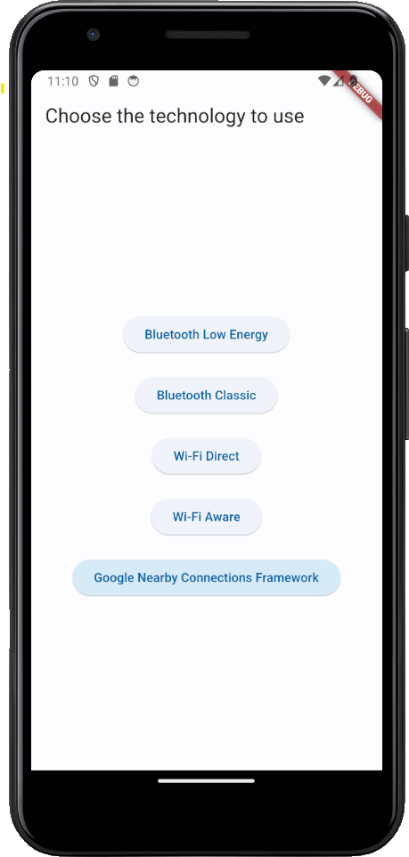
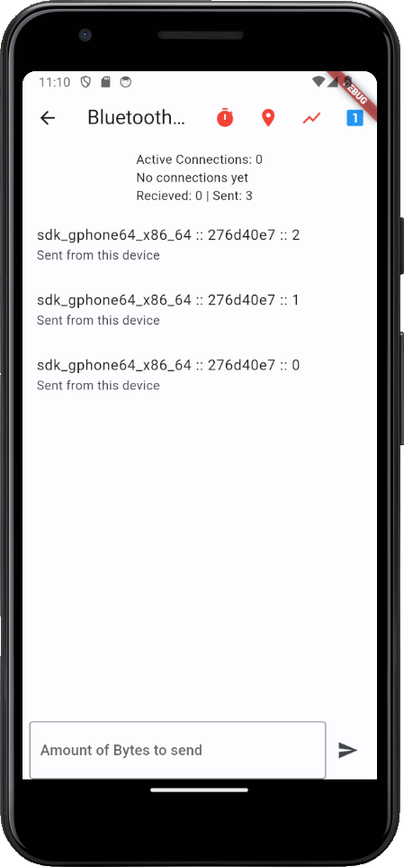
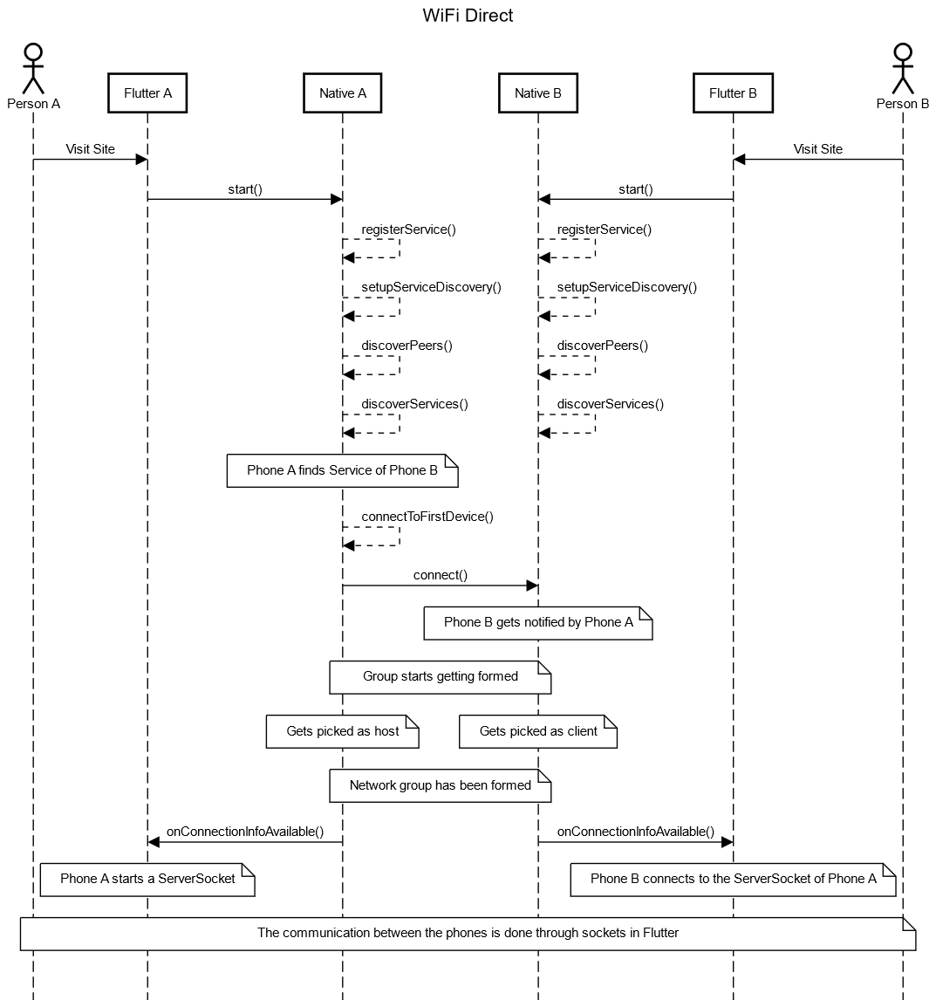
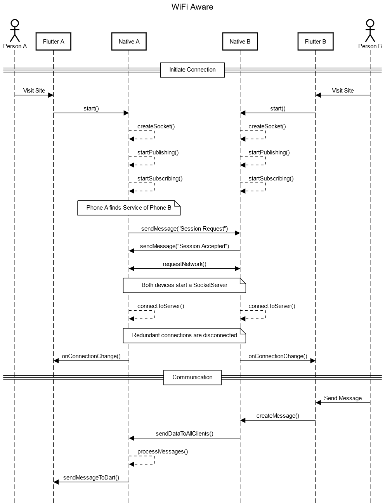
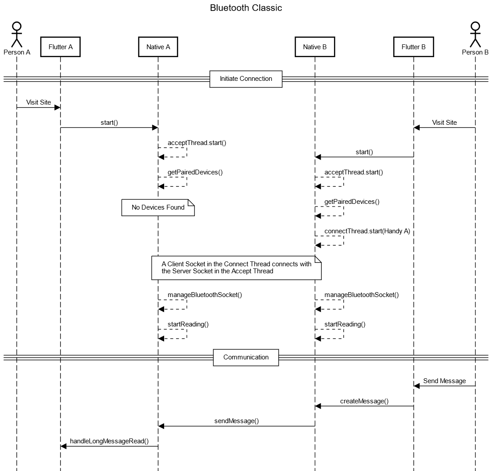
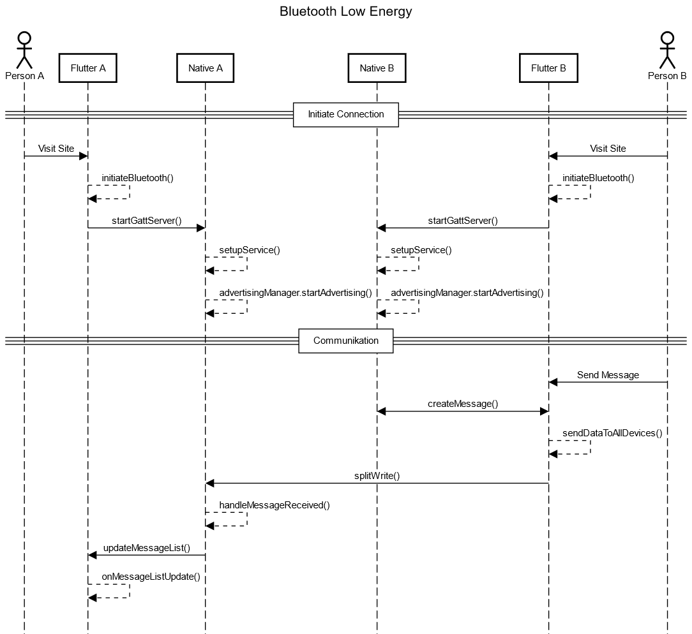

# flutter-p2p-demo

This prototype was created as part of a bachelor thesis. The purpose of this app was to test the kriteria of existing technologies which enable offline data transfer. The app is split into two parts.

## Splash screen

The splash screen of the application lets the user pick between the different technologies to test. Each of the buttons directs the user to what will be reffered to as a "technology page" from now on.

## Technology page

Bluetooth Low Energy was picked as the example page for a technology page. Here the user can see the active connections to other devices running the app, send messages of specific lengths to the other devices and see sent and received messages. Received messaged will display the amount of time it took to send the message. Sent and received messages will show the size of the message.

There are three buttons which the user can toggle at the top of the screen. The clock will automatically send a message to all connected devices every two seconds. The size of this message is determined by the input at the bottom of the page. The location button will enable distance estimation between the devices with GPS. This is achieved by attaching geolocation information to the message. Lastly there is a statistic symbol. This groups all received messages by the amount of time it took to receive them. For Bluetooth Low Energy it is additionally possible to choose between the LE 1M and LE 2M hardware layer for transfer with the button at the top right.

The technology page is typicall built like this.

The message class holds all relevant information for transfer between the devices. The Android location API was used to determine the location. The class is built like this.

### Wi-Fi Direct

A network group is created at the Java level for Wi-Fi Direct. The information about this created group is forwarded to Dart via an event channel. The information forwarded includes the IP address of the host. If the device itself is the host, a server socket is created in Dart. Otherwise, the clients connect to the host in Dart. Further functionality was handled with sockets directly in Dart.

### Wi-Fi Aware

In Wi-Fi Aware, a network group is also created at the Java level. For this the Android Wi-Fi Aware API was used. In contrast to Wi-Fi Direct, however the socket connection is made directly at the Java level. Normal sockets are also used for normal sockets are also used for communication. Messages created by the user are created in Dart and transmitted to Java via the method channel. Newly arrived messages are passed to Dart via event channels in order to output them on the UI.

### Bluetooth Classic

In Bluetooth Classic, a Bluetooth socket is created at the Java level. The Bluetooth socket is similar to normal sockets in terms of implementation. As in Wi-Fi Aware, the messages are sent from Dart to Java via method channels and from Java to Dart via event channels. channels from Java to Dart. Bluetooth Classic is limited in the prototype to a prior coupling of the devices in the prototype. This means that the device must be paired before start the app in the mobile phone settings. This is a one-time necessary process. A separate implementation that allows pairing directly in the app is possible. However, it was omitted in this work. The decision is based The decision is based on the fact that the implementation would cost time without affecting the test functions.

Each technology needed to be implemented differently. Here is an overview of each of the technologies.

### Bluetooth Low Energy

Bluetooth LE requires a GATT server and a client. The server was realised on the Android layer. Here, a service is provided via a unique UUID, with which clients can connect. The server can receive messages from the clients. If a message is received on the Android layer, it is forwarded to Dart via an event channel. forwarded to Dart via an event channel. The client side was implemented directly in Flutter. The Flutter Blue Plus package was used for this. It can be scanned for devices that offer a service with the previously determined UUID. As soon as a device with a matching UUID is found, a connection to this device is established. The client can then send messages to the connected device. The client can be connected to several servers and the server can manage several clients at the same time.

For the client side of Bluetooth Low Energy, the Flutter plugin flutter blue plus was used. For the implementation of this, the documentation on the official website of the website of the plugin was followed.

### Gooogle's Nearby Connections Framework

In addition, Google's Nearby Connections Framework was implemented in the app. For this the Flutter plugin nearby connections was used. By using the plugin no further native code was required for the implementation. For the implementation of the framework, the guidelines on the plugin's website were followed. Since this guide on the specified website already describes the implementation in detail, detailed description is not provided here.